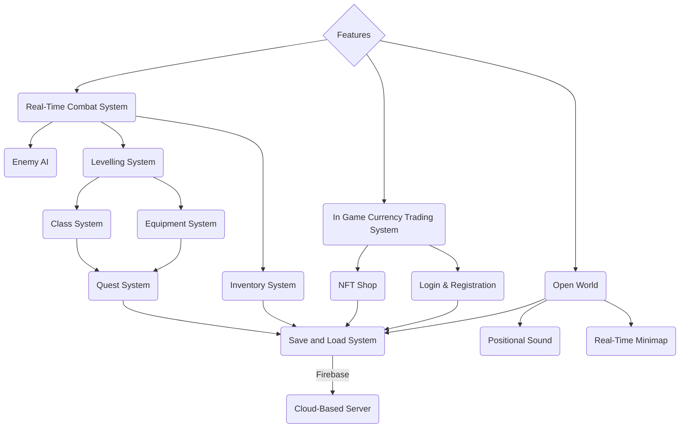


# Readme

## Controls
| Key | Function |
|--|--|
| W | Moves Player Up |
| A | Moves Player Left |
| S | Moves Player Down |
| D | Moves Player Right |
| E | Interact with items, chest and NPCs, exit from interaction |
| F | Consumes Potions to heal up
| ESC | Opens the ESC Menu |
| Left Click | Drags item (in inventory), Skips Dialogues
| Right Click | Attack |
| Z | Opens Inventory
| Scroll Wheel | Select Item in hotbar |
| Space | Skips Dialogues |

## How to Run the game?

### Windows
Simply extract the contents in the zip folder and double click on the .exe file to play

### Linux
Simply extract the contents in the zip folder and double click on the .x86_64 file to play

### HTML5
Please follow the following steps:
 1. Download [python3](https://www.python.org/downloads/)
 2. Extract the contents in the zip folder
 3. Open terminal/cmd in the directory of the extracted contents
 4. Enter `python3 -m http.server`
 5. Open your browser and go to `http://localhost:8000`
 6. Click on JavaBean.html
 7. Enjoy the Game!
 
### MacOS
Please follow the following steps:
 1. Download the .dmg file onto your mac
 2. Go to System Preferences
 3. Go to Security and Privacy
 4. Open up your terminal
 5. Enter the command `sudo spctl --master-disable`
 6. Return to Security and Privacy, click the `Anywhere` checkbox under `Allow apps downloaded from`
 7. Click on the .dmg Game file
 8. Enjoy the Game!
 
## Features

## Links
[Docs](https://docs.google.com/document/d/1wQjGsiPLWeSY_6v22aFV54N9r4aaHnMU-TmhsJElN44/edit?usp=sharing)
[Poster](https://drive.google.com/file/d/1Pbd7DQy5UR8q-0CrDaljOnSG60CKCDUc/view?usp=sharing)
[Video](https://youtu.be/8bh4gXz2Xrk)
[Downloads](https://drive.google.com/drive/folders/1ut8uZUZ6C1Buhvb6ztNxSndZzi016PuH?usp=sharing)
